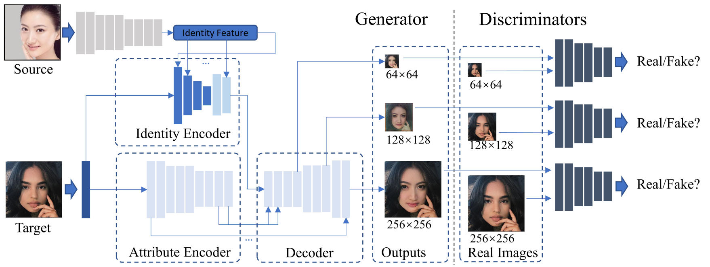
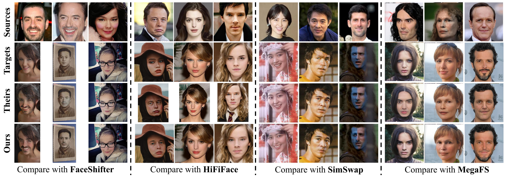

# Migrating Face Swap to Mobile Devices: A lightweight Framework and A Supervised Training Solution

### Introduction

This is the repository for the source code of the papar \
*Migrating Face Swap to Mobile Devices: A lightweight Framework and A Supervised Training Solution*

Accepted to IEEE International Conference on Multimedia and Expo 2022

[[ICME 2022](http://2022.ieeeicme.org/)] [[arXiv](https://arxiv.org/abs/2204.08339)]

### Framework overview



### Preferable configurations

torch==1.6.0

torchvision==0.7.0

cuda version: 10.2

### How to use the code

Firstly, I strongly recommend implementing your own `dataset` class for loading training data, since my implemenation is based the structure of my `data` folder. 
```
class FaceShifterDataset(torch.utils.data.TensorDataset):
    def __init__(self):
        super(FaceShifterDataset, self).__init__()
        # TODO: add your code

    def __getitem__(self, item):
        # TODO: add your code
        return Xs, Xt, GT, with_gt, src_as_true

    def __len__(self):
        # TODO: add your code
        return len(self.data_list)
```
Basically, the `__getitem__` function returns five elements:
* `Xs`: the source image.
* `Xt`: the target image.
* `GT`: the ground truth image. If none, an equivalent tensor with all values being -1. 
* `with_gt`: (`torch.float32`) whether the training data has a ground truth label (the value can be either `1` or `0`).
* `src_as_true`: (`bool`) used to indicate whether the source or the target is a real image. Selected real images are used to feed the discrimiator.

Note that images are with shape being (3, 256, 256) and values in (-1, 1). Images are in format `torch.tensor` with `dtype` being `torch.float32`.

After that, reset the arugments inside `main.py` and refer to `run_training.sh`. Note that my implementation uses `DistributedDataParallel` on 4 GPUs within one machine. Please adjust the settings based on your own hardware. 

### Performance

##### Qualitative performance




##### Comparisons of model size

| Model                 | Model Size (MB)      |
|-----------------------|----------------------|
| FaceShifter (PyTorch) | 669.0 + 64.0 + 168.0 |
| MegaFS (PyTorch)      | 3529.0 + 364.0       |
| SimSwap (PyTorch)     | 766.9 + 220.2        |
| Ours (Pytorch)        | 10.2 + 4.9           |
| Ours (CoreML)         | 15.0                 |
| Ours (TNN)            | 14.8                 |

### Citation

If you find my work useful, please cite:

```
@article{mobilefsgan,
author = {Haiming Yu and Hao Zhu and Xiangju Lu and Junhui Liu},
title = {Migrating Face Swap to Mobile Devices: A lightweight Framework and A Supervised Training Solution},
journal = {in ICME}, 
year = 2022
}
```

